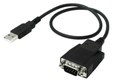

Serial Communication
=================
Overview
--------
<br>
<p align="center">
  
  
</p>
<br>

This is a very light weight C++ package which is used for serial port communication in Windows. The package uses "windows.h"'s - WriteFile, ReadFile to interact with the serial port. 
- Extra info about windows.h you may refer https://docs.microsoft.com/en-us/windows/win32/fileio/opening-a-file-for-reading-or-writing

Usage
-----
To build another project upon this module, you may refer <a href="https://github.com/JY-Quek/GWInstek-Controller">GWInstek Controller</a>.
<br><br>

Below are some simple examples:

Eg 1. To initialize the class.
```cpp
const char *portName = "\\\\.\\COM6";
SerialCommunication BoardController(portName);
```

Eg 2. To send serial command "MeasureVoltage" to the port.
```cpp
string command_to_send = "MeasureVoltage";	
char* char_arr = &command_measure[0]; // convert string to char
BoardController.writeSerialPort(char_arr);
```

Eg 3. To receive serial output from the port.
```cpp
string receivedString = BoardController.readSerialPort(5); // 5 seconds timeout
```


## Build this with CMake and Visual Studio MSBuild 2019
-----
*1.* Clone or download this repository. Navigate into the folder's directory and run the below command.

```bash
mkdir build
cd build
cmake .. -G "Visual Studio 16 2019" -A Win32
cmake --build . --target ALL_BUILD --config Release
```

*Change the line "Win32" to "x64" if you are using DLLs which are based on 64-bit

